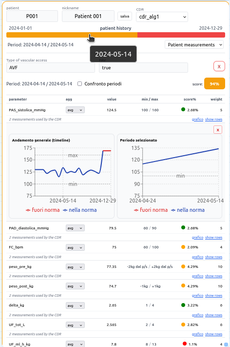
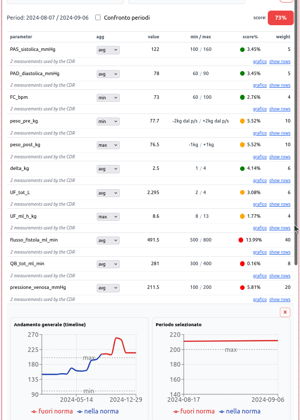
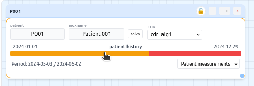

# Clinical Parameters Dashboard

## Overview

**Clinical Parameters Dashboard** è un progetto software che presenta una dashboard interattiva per l’analisi dei parametri clinici dei pazienti nel tempo.

Il progetto nasce nel contesto di **SIATE – Sistema di Analisi dei Parametri Clinici per Pazienti in Emodialisi**, un sistema più ampio progettato per supportare l’interpretazione dei dati sanitari attraverso strumenti di visualizzazione e analisi.

Questo repository non rappresenta l’intero sistema SIATE, ma la parte del progetto sviluppata personalmente, in particolare:

- il **Patient Widget** per l’analisi dei parametri clinici del paziente
- un **backend di supporto** per la gestione dei dati
- l’integrazione **frontend–backend**
- la **canvas interattiva** utilizzata per ospitare i widget della dashboard

Il progetto dimostra come sia possibile trasformare **misurazioni cliniche grezze** in una **dashboard interattiva** capace di visualizzare l’evoluzione dei parametri sanitari nel tempo.

---

# System Architecture

L’architettura del sistema è organizzata in tre livelli principali:

Utente
↓
Frontend (React Dashboard)
↓
API Requests
↓
Backend (Flask)
↓
Dataset clinici simulati (JSON)


### Frontend
Una dashboard sviluppata con **React** che consente di:

- visualizzare i parametri clinici del paziente
- analizzare l’andamento temporale dei dati
- confrontare i valori con intervalli di riferimento
- calcolare uno **score sintetico dello stato clinico**

### Backend

Il backend è stato sviluppato utilizzando **Flask** ed ha lo scopo di:

- fornire dati clinici al frontend
- gestire dataset sanitari simulati
- supportare la logica di valutazione dei parametri

Nel sistema originale SIATE non era disponibile un backend funzionante.  
Per questo motivo è stato sviluppato un **backend minimale di supporto** per permettere al widget di funzionare e dimostrare il comportamento del sistema.

### Data Layer

I dati clinici sono simulati e memorizzati in **file JSON**, che rappresentano:

- pazienti
- parametri clinici
- intervalli di normalità
- pesi utilizzati nel calcolo dello score

---

# Project Structure

```text
clinical-parameters-dashboard
│
├── backend/
│ ├── app.py
│ ├── algoritmo/
│ │ ├── algoritmo1.py
│ │ ├── regole_parametri.py
│ │ └── pesi_importanza.json
│ │
│ └── data/
│ ├── pazienti_emodialisi.json
│ ├── valori_norma_emodialisi.json
│ └── altri dataset simulati
│
├── frontend/
│ ├── src/
│ │ ├── components/
│ │ │ ├── canvas/
│ │ │ ├── PatientModule/
│ │ │ └── widgets/
│ │ │
│ │ ├── context/
│ │ ├── services/
│ │ └── utils/
│ │
│ └── App.jsx
│
└── README.md
```

### Backend

Contiene:

- API Flask
- logica di analisi dei parametri clinici
- dataset sanitari simulati

### Frontend

Contiene:

- la **dashboard React**
- il **Patient Widget**
- i componenti della **canvas interattiva**
- servizi per la comunicazione con il backend

---

# Key Features

### Patient Widget

Il widget principale della dashboard consente di:

- visualizzare i parametri clinici del paziente
- confrontare i valori con intervalli di normalità
- analizzare l’andamento temporale dei parametri
- calcolare uno **score aggregato dello stato clinico**

### Clinical Timeline

Il sistema permette di:

- visualizzare l’evoluzione dei parametri nel tempo
- identificare valori fuori norma
- confrontare periodi temporali differenti

### Scoring dei parametri clinici

Lo stato del paziente viene valutato attraverso una logica basata su:

- intervalli di riferimento dei parametri
- pesi assegnati ai parametri
- aggregazione dei valori disponibili

Il risultato è uno **score percentuale** che rappresenta la stabilità dei parametri clinici.

---

## Screenshots

### Patient Dashboard

Il **Patient Widget** rappresenta il componente principale della dashboard e consente di analizzare i parametri clinici del paziente nel tempo.

Funzionalità principali:

- visualizzazione dei parametri clinici
- confronto con intervalli di riferimento
- calcolo dello score clinico
- analisi temporale dei dati sanitari



---

### Clinical Parameters Table

La tabella dei parametri mostra i valori clinici del paziente insieme agli intervalli di normalità e contribuisce al calcolo dello score complessivo.



---

### Clinical Timeline

La timeline consente di osservare l’evoluzione dei parametri clinici nel tempo, facilitando l’interpretazione dell’andamento dei dati sanitari.



# Technologies

Frontend

- React
- JavaScript
- Component-based architecture
- Data visualization

Backend

- Python
- Flask
- JSON datasets

Tools & Development

- Git / GitHub
- AI-assisted development tools

---

# Running the Project

### Backend

cd backend
pip install -r requirements.txt
python app.py


Il backend avvierà un server Flask per fornire i dati al frontend.

### Frontend

cd frontend
npm install
npm run dev


La dashboard sarà disponibile nel browser.

---

# Limitations

Questo repository rappresenta **una parte del sistema SIATE**, non il sistema completo.

In particolare:

- il backend è una versione **semplificata di supporto**
- i dataset clinici sono **simulati**
- nel sistema originale sono presenti **altri widget non inclusi in questo repository**

L’obiettivo del progetto è dimostrare il funzionamento del **Patient Widget** e l’integrazione tra frontend e backend.

---

# Author Contribution

Nel contesto del progetto accademico SIATE:

Sviluppato personalmente in questo repository:

- progettazione e sviluppo del **Patient Widget**
- sviluppo del **backend Flask di supporto**
- integrazione **frontend–backend**
- sviluppo della **canvas per la dashboard**

Il progetto è stato realizzato come **progetto accademico presso ITS ICT Academy**.

---

# Future Improvements

Possibili evoluzioni del progetto:

- integrazione con un database reale
- utilizzo di dataset clinici reali
- estensione della dashboard con nuovi widget
- integrazione con modelli di **Machine Learning per la previsione dello stato del paziente**